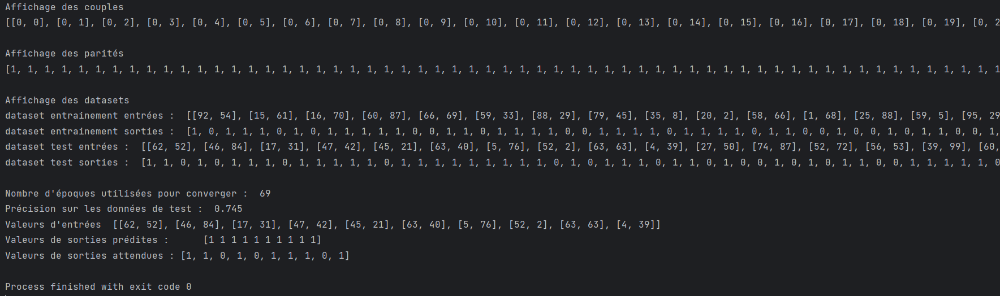

# TP : Réseau de Neurones avec Scikit-Learn

## Étudiants
- BONNAND Adrien
- LESBATS Paul

## Objectif

Entraîner un réseau de neurones avec Scikit-learn pour prédire la parité du produit de deux entiers.

## Étapes

- Génération des couples `[i, j]` pour `i, j ∈ [0, NUMBER-1]`
- Calcul de `y = 1` si `i * j` est pair, sinon `0`
- Séparation 80 % entraînement, 20 % test
- Création d’un MLP avec 1 couche de 15 neurones
- Entraînement et évaluation du modèle

## Exemple Log Entrainement

